# Building Cloud Business Applications for iStore

📌 Descripción General del Proyecto - Arquitectura de Datos para iStore

El presente proyecto tiene como objetivo implementar una arquitectura moderna de datos para la empresa iStore, permitiendo una gestión eficiente, automatizada y escalable de la información proveniente de diversas fuentes internas.

Esta arquitectura está diseñada para centralizar los datos operativos y analíticos, optimizar su procesamiento mediante herramientas de ETL, y ofrecer acceso flexible y seguro a través de interfaces como Power BI, Excel y PowerApps.

Se emplean tecnologías en la nube como Azure SQL y Microsoft Fabric, permitiendo a iStore una solución robusta, integrada y lista para el análisis avanzado y la toma de decisiones en tiempo real.

🎯 Objetivos Principales

- Centralizar datos de diversas fuentes (Excel, SQL).
- Automatizar flujos ETL con Microsoft Fabric.
- Integrar PowerApps como capa de entrada y edición de datos.
- Consolidar un Data Warehouse para reportes confiables.
- Facilitar el análisis con Power BI y distribución por correo.

# Solución de Negocio Cloud con Microsoft Fabric, Power Platform y Power BI

Este proyecto implementa una solución de negocio moderna utilizando:

- 🧱 **Microsoft Fabric Warehouse** y **Data Factory** para gestión de datos.
- ⚙️ **Azure SQL** para almacenamiento estructurado.
- ⚡ **Power Apps** para el desarrollo de aplicaciones low-code.
- 📊 **Power BI** para análisis de datos e inteligencia de negocios de autoservicio.

---

## 🚀 Diagrama de la arquitectura del proyecto

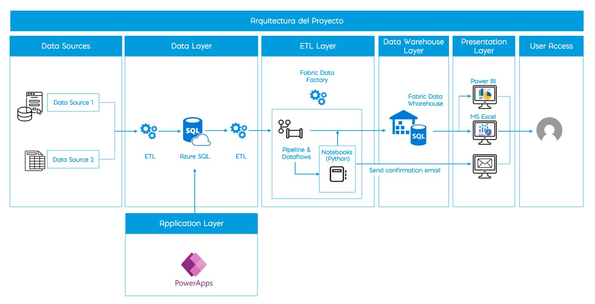

1. Data Sources: Los datos provienen de archivos Excel y de un sistema de escritorio con estructura propia. Ambos se integran inicialmente a través de procesos manuales o semi-automatizados.

2. Data Layer: Centraliza la información recopilada en una base de datos relacional en Azure SQL, permitiendo un almacenamiento seguro y estructurado en la nube. También registra datos desde PowerApps.

3. Application Layer: Utiliza Microsoft Power Apps como interfaz gráfica para el ingreso y edición de datos, directamente conectada al entorno de Azure.

4. ETL Layer: Implementada con Pipelines y Dataflows de Microsoft Fabric, automatiza el flujo de datos hacia el Data Warehouse, e incorpora Notebooks en Python para validación y notificación por correo.

5. Data Warehouse Layer: Almacena los datos ya transformados en un Fabric Data Warehouse, optimizado para análisis avanzado y consolidación de información.

6. Presentation Layer: Brinda acceso a reportes interactivos mediante Power BI Service y en Excel, facilitando la toma de decisiones basada en datos.

7. User Access : Permite gestionar accesos según roles definidos en Azure, Power Apps y Power BI. Los usuarios reciben correos automáticos tras cada actualización, garantizando trazabilidad y comunicación.

---

## Data Layer (Capa de Datos)

Azure SQL: Base de datos en la nube donde se almacenan los datos procesados desde múltiples orígenes.
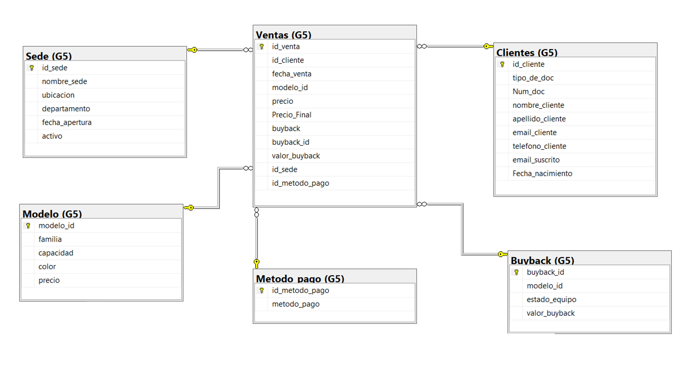

---

## Application Layer (Capa de aplicación)

Pantalla de bienvenida
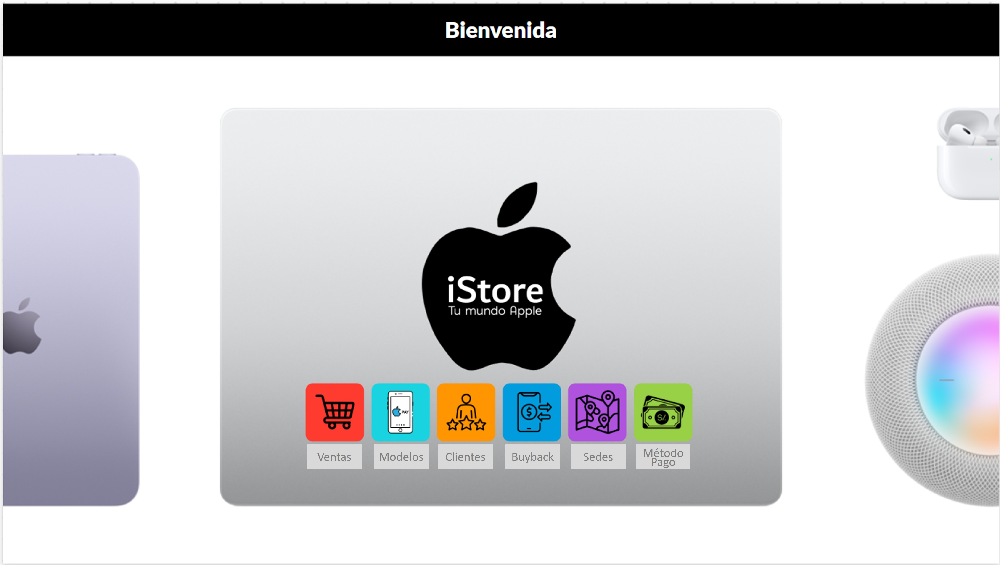

Pantalla de Ventas
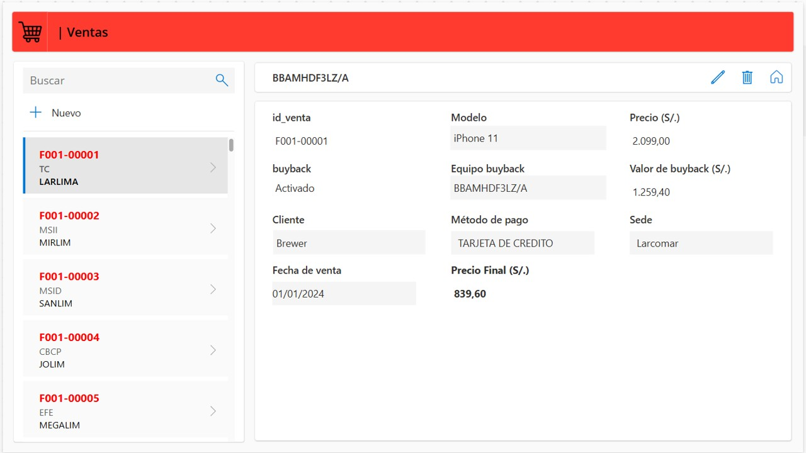

Pantalla de Clientes
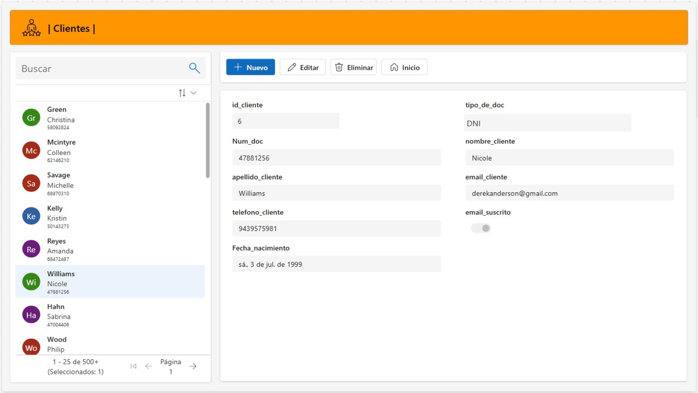

Pantalla de Sedes
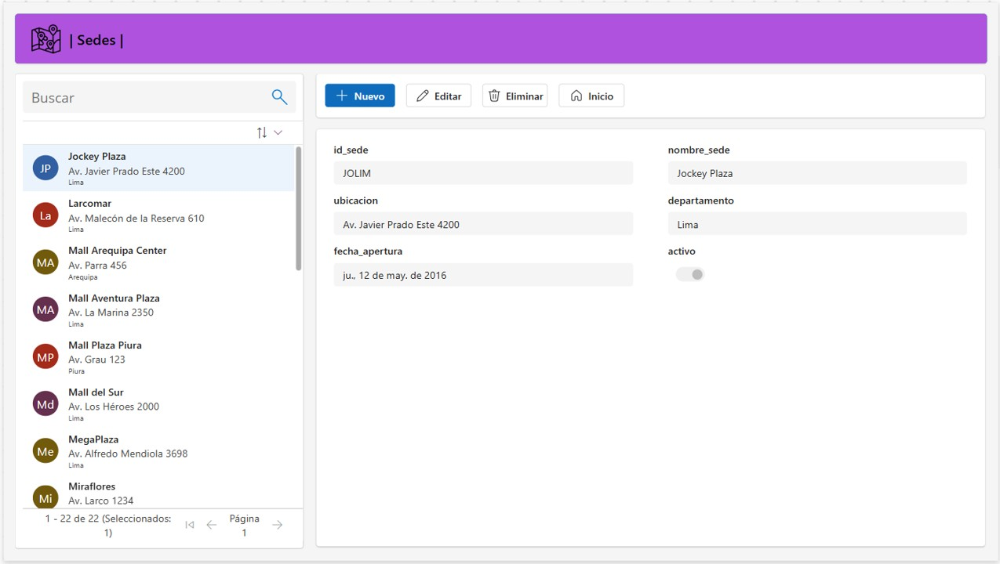

Pantalla de Metodo de Pago
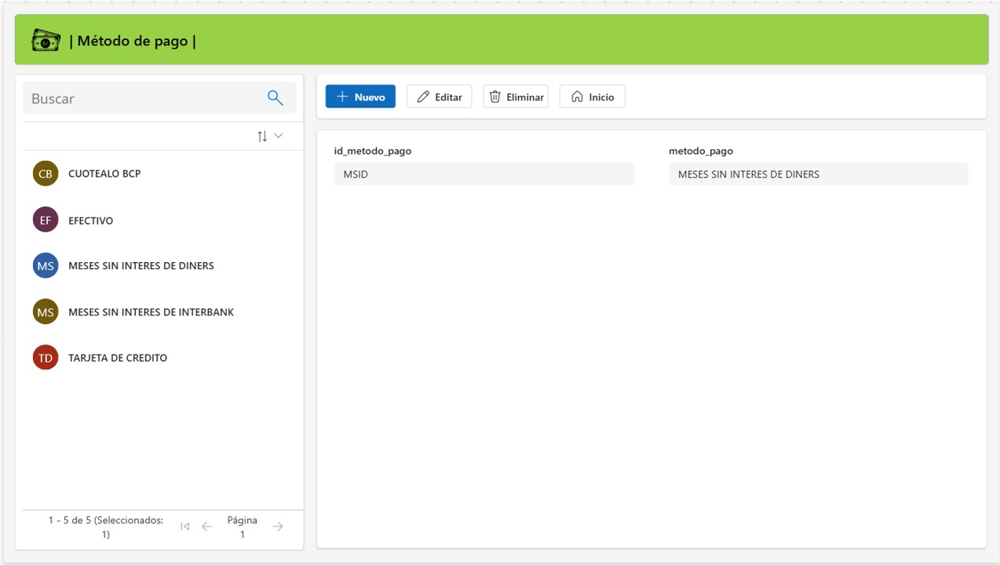

Pantalla de Buyback
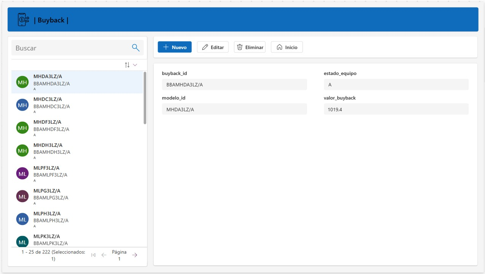

---

## ETL Layer (Capa de extracción, transformación y carga)

El pipeline llamado "pl_update_table" se ejecuta todos los días a las 6:00 a.m.
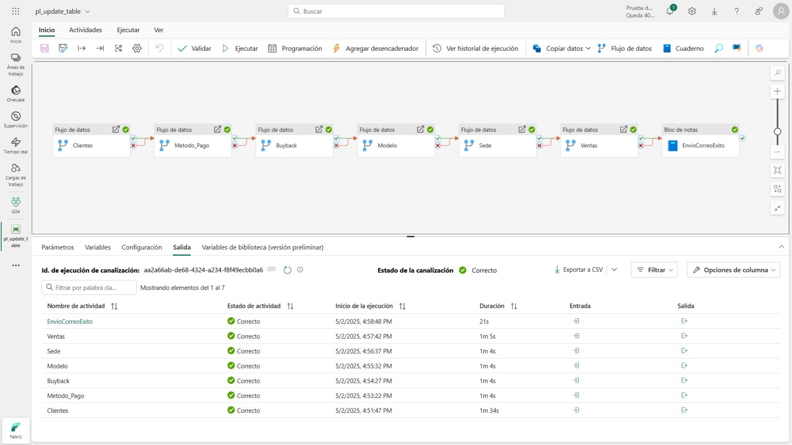

Notebook: NotificarExitoPipeline
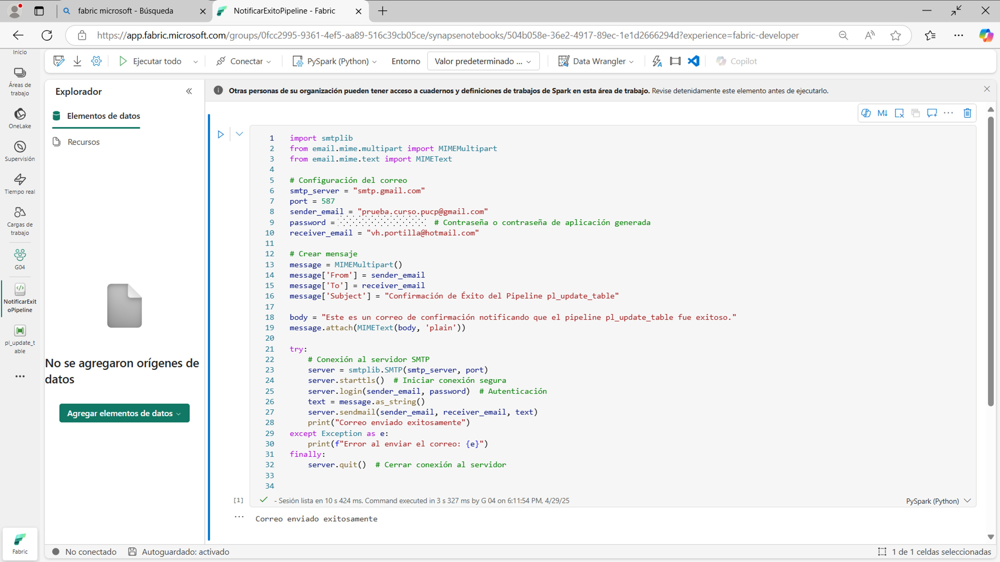

Correo electrónico de notificación del éxito del pipeline
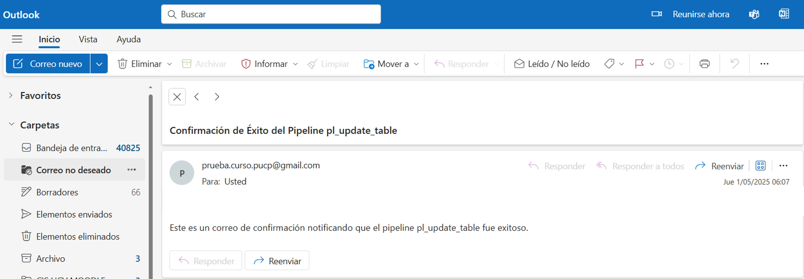

---

## Data Warehouse Layer (Capa de almacén de datos)

Vista del Data Warehouse en Microsoft Fabric
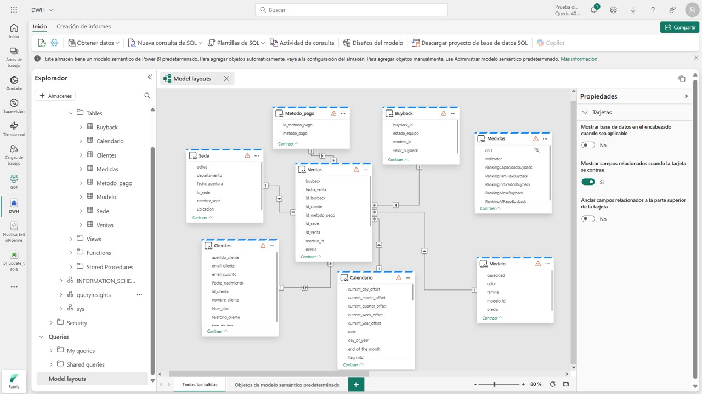

---

## Presentation Layer (Capa de presentación)

Reportes con Microsoft Power BI Service.

Informe 1
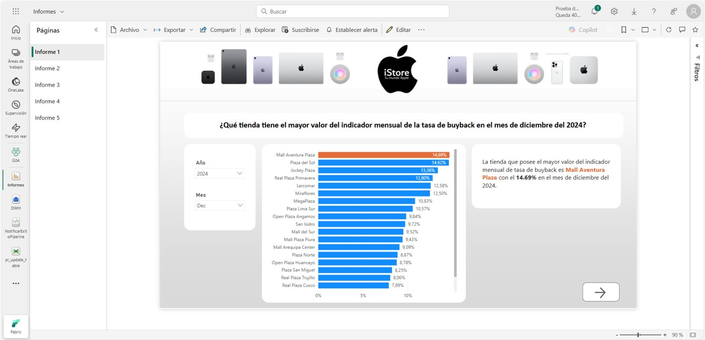

Informe 2
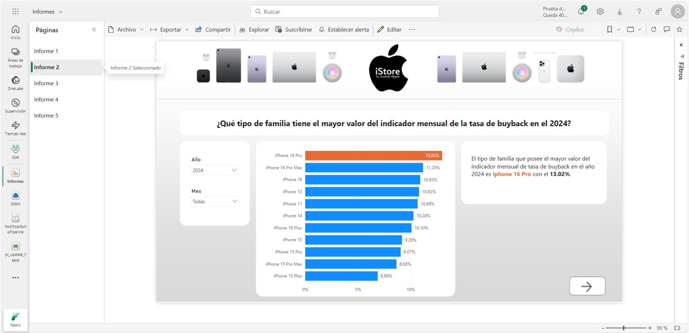

Informe 3
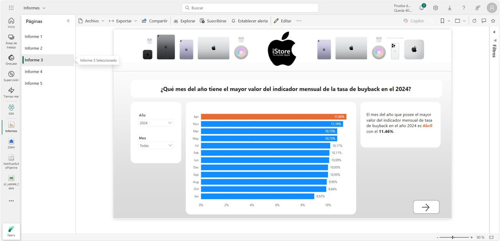

Informe 4
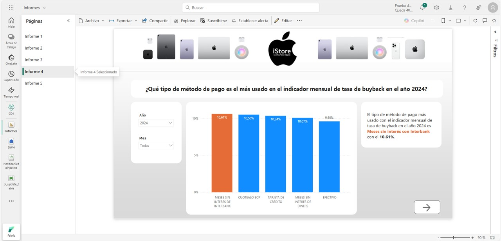

Informe 5
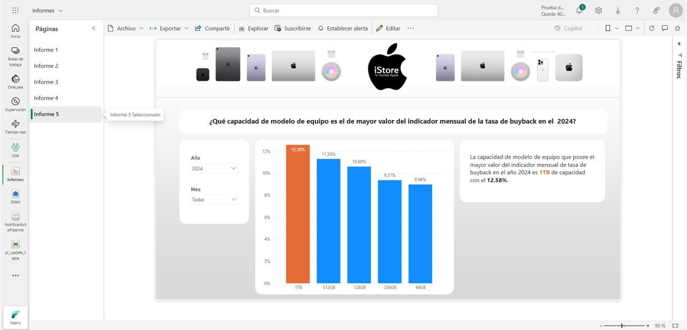

---

# Conclución
Este proyecto evidencia el poder de integrar el ecosistema Microsoft —incluyendo Power Apps, Azure SQL, Microsoft Fabric y Power BI— para construir una solución empresarial robusta, escalable y centrada en el usuario. La arquitectura desarrollada no solo optimiza el flujo de datos y la toma de decisiones, sino que también reduce significativamente los tiempos de desarrollo, mejora la trazabilidad y garantiza una operación eficiente con una experiencia de usuario intuitiva y segura.

Además, permite:

✅ Centralizar y gobernar datos de múltiples orígenes en un entorno confiable y accesible.

✅ Automatizar procesos ETL mediante pipelines y notebooks en Fabric, asegurando precisión y agilidad.

✅ Notificar a los usuarios con correos automáticos que refuerzan la trazabilidad y el control operativo.

✅ Facilitar el ingreso de datos con Power Apps, eliminando barreras técnicas para los usuarios finales.

✅ Visualizar y analizar la información con Power BI y Excel, promoviendo la inteligencia de negocio en todos los niveles.

✅ Proteger el acceso a la información, gracias a la gestión de roles y permisos definidos en Azure.

En conjunto, esta solución representa un modelo eficaz de transformación digital con herramientas Microsoft, alineado con los objetivos de eficiencia, crecimiento y experiencia de usuario que exige el entorno empresarial actual.
