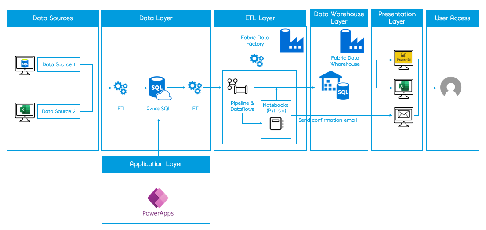

# iStore-final (Building Cloud Business Applications)

📌 Descripción General del Proyecto - Arquitectura de Datos para iStore

El presente proyecto tiene como objetivo implementar una arquitectura moderna de datos para la empresa iStore, permitiendo una gestión eficiente, automatizada y escalable de la información proveniente de diversas fuentes internas.

Esta arquitectura está diseñada para centralizar los datos operativos y analíticos, optimizar su procesamiento mediante herramientas de ETL, y ofrecer acceso flexible y seguro a través de interfaces como Power BI, Excel y PowerApps.

Se emplean tecnologías en la nube como Azure SQL y Microsoft Fabric, permitiendo a iStore una solución robusta, integrada y lista para el análisis avanzado y la toma de decisiones en tiempo real.

🎯 Objetivos Principales

- Centralizar datos de diversas fuentes (Excel, SQL).

- Automatizar flujos ETL con Microsoft Fabric.

- Integrar PowerApps como capa de entrada y edición de datos.

- Consolidar un Data Warehouse para reportes confiables.

- Facilitar el análisis con Power BI y distribución por correo.

# 🌐 Solución de Negocio Cloud con Microsoft Fabric, Power Platform y Power BI

Este proyecto implementa una solución de negocio moderna utilizando:

- 🧱 **Microsoft Fabric Warehouse** y **Data Factory** para gestión de datos.
- ⚙️ **Azure SQL** para almacenamiento estructurado.
- ⚡ **Power Apps** para el desarrollo de aplicaciones low-code.
- 📊 **Power BI** para análisis de datos e inteligencia de negocios de autoservicio.

---

## 🚀 Diagrama de arquitectura del proyecto

## 📸 Capturas de Pantalla

### 🔧 Aplicación en Power Apps

### 🧩 Diseño del Data Factory

### 🏢 Vista del Warehouse en Microsoft Fabric

### 📈 Dashboard en Power BI

---

# Conclución
Esta solución demuestra cómo integrar plataformas Microsoft para crear sistemas empresariales escalables, accesibles y potentes, con bajo tiempo de desarrollo y alta eficiencia operativa.
